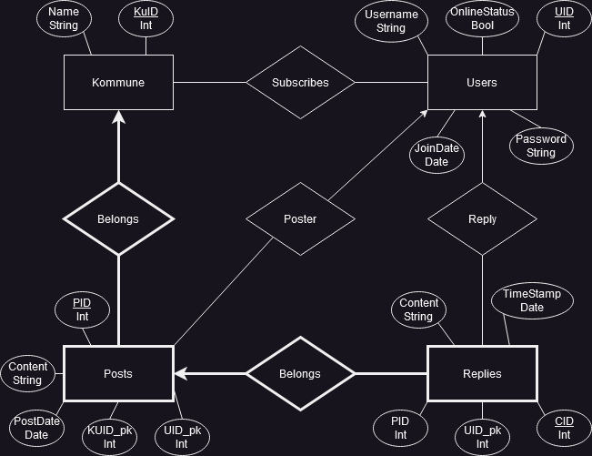

# DISProj
Project repo for DIS Project

## E/R Diagram



## Prerequisites needed for this WebApp
- Python [&ge; 3.10.6]
- Flask [&ge; 2.3.2]
- Jinja2 [&ge; 3.1.2]
- psycopg2-binary [&ge; 2.9.6]
- pgAdmin4 & postgresQL

## How to clone repo

To clone this repository, firstly create or choose a place where this project is gonna be place.

Then go to that directory and run the following code:
```bash
git clone https://github.com/nickgismokato/DISProj.git
```
This will clone the repository and put it into a folder called `DISProj`.

## postgress prerequisites
1) Create a server if no server has been created
2) Change the password of the user `postgres` to **postgres**
3) Create Database called DIKUChan where the owner is the `postgres` user

<ins> **Alternative** </ins>

Set your own parameters in the file `source/dbparameters.py`

## How to run application


navigate to the project folder `~/DISProj`. From here run the following commands:
```bash
source bin/activate
export FLASK_APP=source/main.py
flask run
```

This WebAPP should now run with the following code in the terminal:

```sh
* Serving Flask app 'source/main.py'
* Debug mode: off
WARNING: This is a development server. Do not use it in a production deployment. Use a production WSGI server instead.
* Running on http://127.0.0.1:5000
Press CTRL+C to quit
```

## How to navigate our webapp
### Create users and login:
You can press login and then press the ``Create User``. This will redirect you to a page where you have to submit a username and password. After that you can then login with your newly created user.

### Profile stuff
When you have logged in then you can go to your profile page by pressing `Your Profile!` in the header.

There you can see the municipalities you currently are subscribed to and those you can subscribe to. In here you can also delete your user by pressing the button `Delete Your Profile`.

By subscribing to a municipality, your list User subscriptions should gain the subscription. There you can press the links `Click Here` to go to the forum of said municipality or you can also unsubscribe.

### Navigating posts
When on a post you should only be able to see the post which is unique for the municipality. You can also write your own post. On each post you can see there is a text `Go To Post`. By pressing this you should go to the post and comments. This haven't been implemented yet. 

Also no there currently is no way of deleting a post.

## shortcomings
We have created several features that manipulate the database. However, due to inexperience in web-development and time-constraints, these have not been implemented. Also, we have switched between inline styling and a universal stylesheet. This is bad practice, but we only realised this at the end.